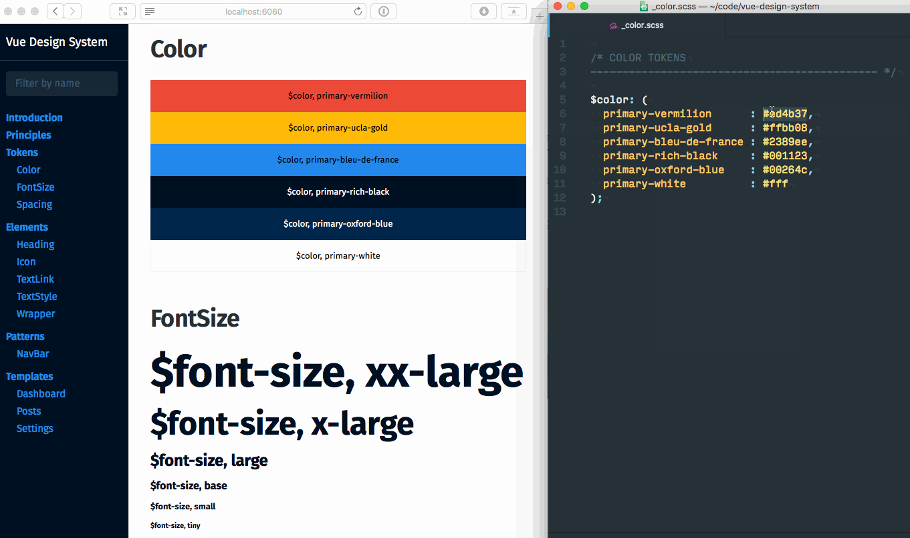

  

# Vue Design System

[Vue Design System](https://vueds.com) is an open-source tool for building UI design systems. It provides you and your team a set of organized tools, patterns & practices to build upon, so that you can get started with the actual design system faster.

The tool is built on top of [Vue.js](https://vuejs.org), [Vue Styleguidist](https://github.com/vue-styleguidist/vue-styleguidist), [Vue Webpack Template](http://vuejs-templates.github.io/webpack/) & [Theo](https://github.com/salesforce-ux/theo) and is aimed for designers and front-end developers who have at least basic knowledge of component based workflows + HTML, SCSS & JavaScript.

Even though this is a system prototyping tool first and foremost, it has all the means to turn into your organization’s actual design system in the end.

**Made by [@viljamis](https://twitter.com/viljamis) and other contributors. See also [the official website](https://vueds.com) of Vue Design System.**

## Features

* A set of interconnected patterns & practices for you and your team.
* Global design tokens that can be used inside any component.
* Design System can be used as an NPM dependency in another project.
* Simple and sane SVG icon and @font-face defaults.
* Live reloading for both the app and the system documentation.
* Automatic generation of documentation.
* Documentation and the app logic are separated, so you can have public docs while the app itself is private.
* Autoprefixing, SCSS, Webpack & CSS extraction included by default _(Extend with lint-on-save & unit tests)._
* And more…

## Documentation

* **[Getting Started](https://github.com/viljamis/vue-design-system/wiki/getting-started): How to install and run Vue Design System.**
* [Terminology](https://github.com/viljamis/vue-design-system/wiki/terminology): Introduction to the system concepts and its hierarchy.
* [Naming of Things](https://github.com/viljamis/vue-design-system/wiki/naming-of-Things): Naming is hard, so it’s good to have clear guidelines.
* [Directory Structure](https://github.com/viljamis/vue-design-system/wiki/directory-structure): What goes where and why.
* [Working with the System](https://github.com/viljamis/vue-design-system/wiki/working-with-the-system): Concrete examples on how to work with `Tokens`, `Elements` , `Patterns` and `Templates`.
* [Editing Living Documentation](https://github.com/viljamis/vue-design-system/wiki/editing-living-documentation): How to customize the living system documentation.
* [Component Status](https://github.com/viljamis/vue-design-system/wiki/Component-Status): Clear labels that reflect the state of completion.
* [Component QA](https://github.com/viljamis/vue-design-system/wiki/Component-QA): How to review new components and keep the quality high.
* [Frequently Asked Questions](<https://github.com/viljamis/vue-design-system/wiki/frequently-asked-questions-(FAQ)>): How to use icons, how to use font-face, etc.

## Examples

* **[Vue Design System website](https://vueds.com)**

## Roadmap

* See [Roadmap tag](https://github.com/viljamis/vue-design-system/issues?q=is%3Aissue+is%3Aopen+label%3Aroadmap) in the issues.

## Changelog

* `1.0.0` is the latest release.
* See [Releases page](https://github.com/viljamis/vue-design-system/releases) for the full changelog.

## Authors and License

[Viljami Salminen](https://viljamis.com), [Artem Sapegin](http://sapegin.me), [Rafael Escala](https://github.com/rafaesc), [react-styleguidist contributors](https://github.com/styleguidist/react-styleguidist/graphs/contributors), [vue-styleguidist contributors](https://github.com/vue-styleguidist/vue-styleguidist/graphs/contributors), [Vue.js contributors](https://github.com/vuejs/vue/graphs/contributors), [vue-webpack-boilerplate contributors](https://github.com/vuejs-templates/webpack/graphs/contributors) and & [Theo contributors](https://github.com/salesforce-ux/theo/graphs/contributors).

Licensed under the [MIT license](https://github.com/viljamis/vue-design-system/blob/master/LICENSE).
